# jb2profile

Some profiling on jbrowse 2

## Pre-requisites

Install pbsim2, add to path

## Setup

To setup from scratch, see source code for the breakdown of the scripts

```
./everything.sh
```

## Results

### How to read results

- igvjs - a create-react-app with igv package from npm installed
- jbrowse-web-1.6.5 - stock
- jbrowse-web-1.6.7 - stock
- jbrowse-web-1.6.9 - stock
- jbrowse-web-1.7.4 - stock
- jb2 noserial - removes serialization across webworker which removes ability to click on features, and is just here to demonstrate the overhead of serialization
- jb2 embedded lgv - a create-react-app with @jbrowse/react-linear-genome-view

## Notes

- these tests are all chrome based (using puppeteer library for automation),
  running same on firefox or safari may be slower (especially on jbrowse-web)
- these benchmarks are not comprehensive, and just a taste of some small
  examples on simulated data on volvox

### Platform

Ran tests on a Dell Precision i9 laptop, ~2019, Ubuntu 22.04

Tests will also be run on a Amazon EC2 instance xlarge 4vcpu 16gb memory ubuntu 20.04

### How to interpret test names

The test e.g. volvox-20x-shortread-cram-10kb.json shows the coverage of the file being tested and region size being viewed

### Figures

#### Runtime

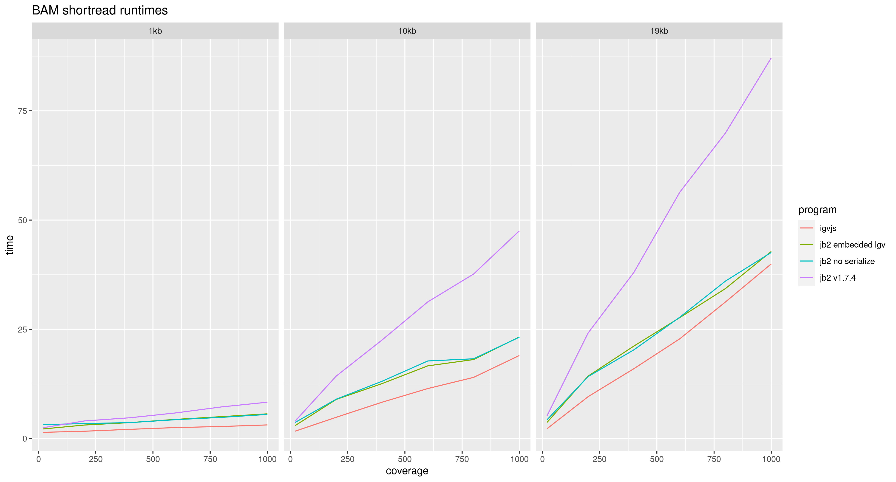
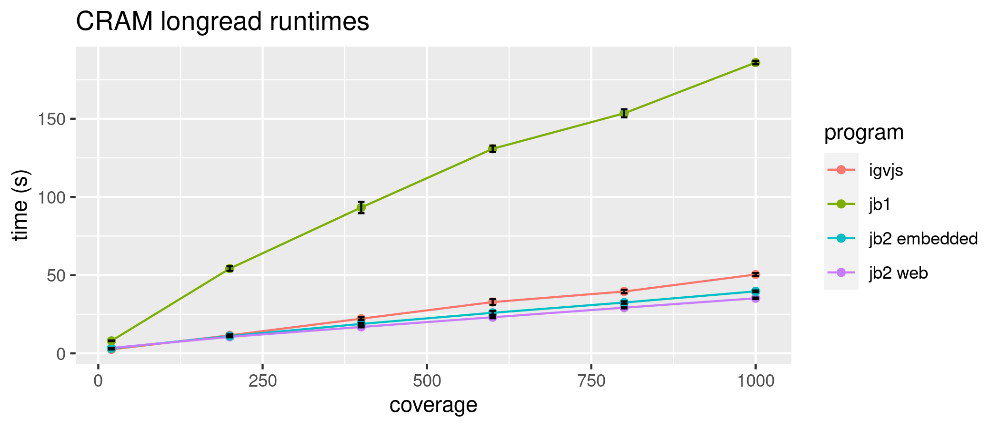
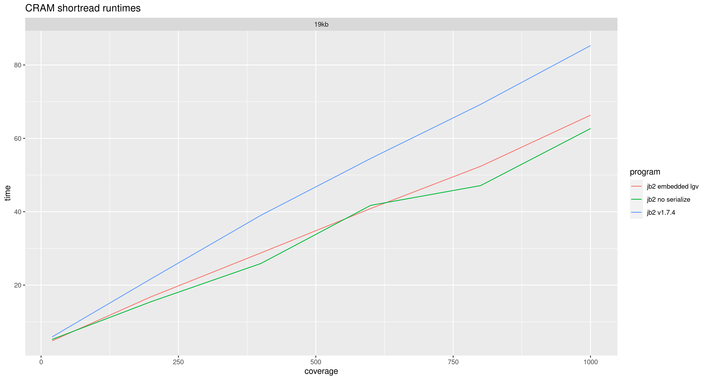
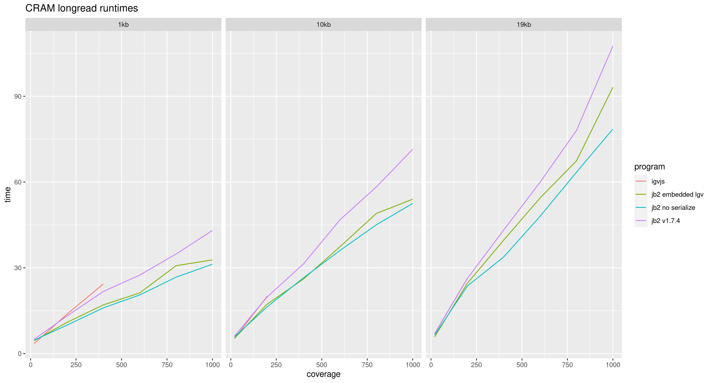

#### Memory (probably not accurately be reporting webworker memory)

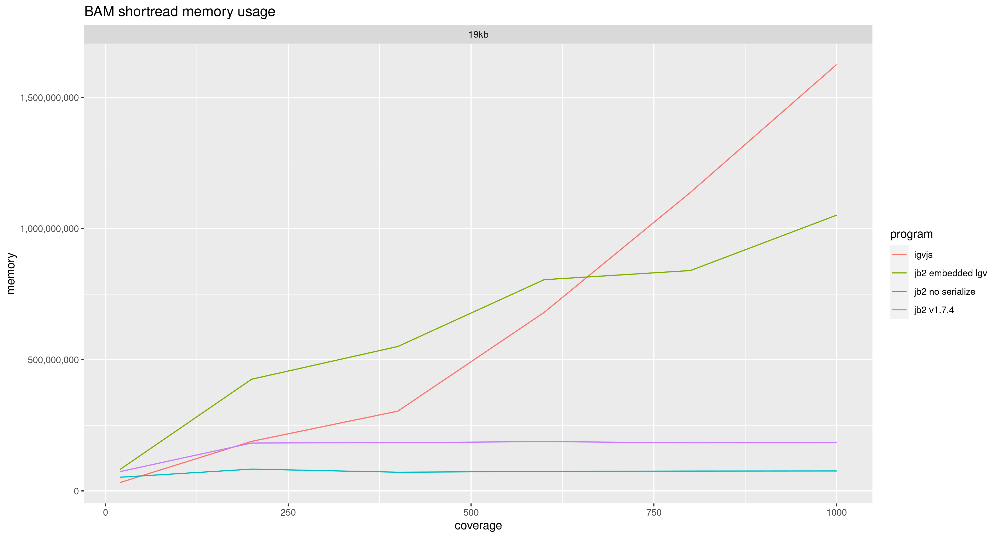
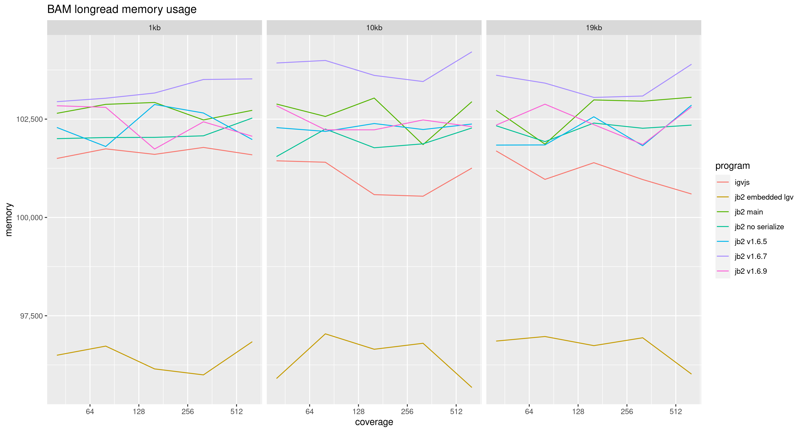
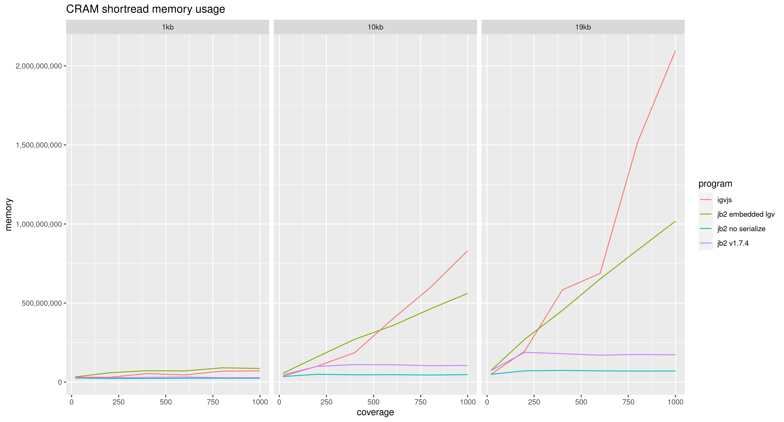
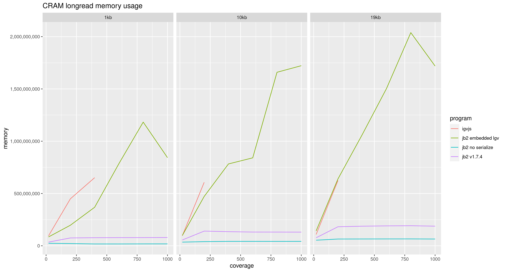

#### Average FPS

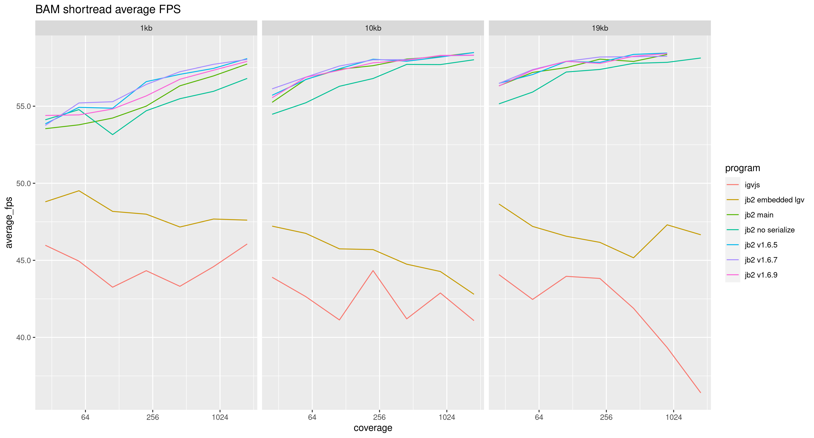
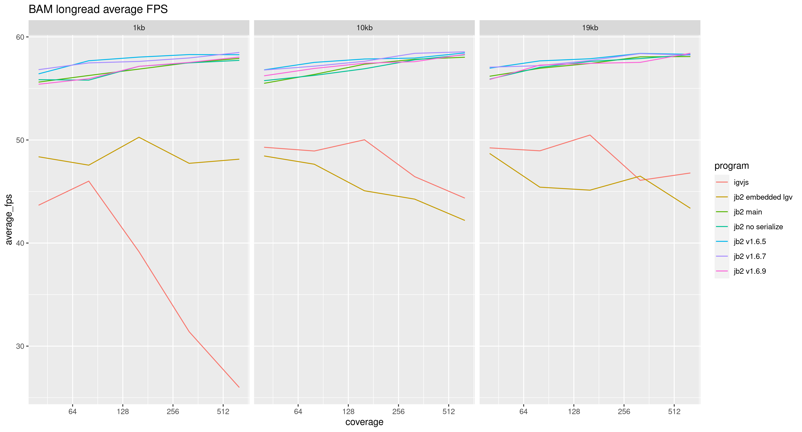
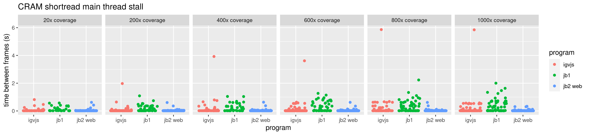


#### Multi

results/multi-highcov-10kb.json
| Command | Mean | Relative |
| :--------------------------------------------------------------------------------------------------------------------------------------------------------- | :---- | :------- |
| igvjs | 30.8 | 1.53 |
| jb2 v1.6.5 | 41.1 | 2.03 |
| jb2 v1.6.7 | 39.4 | 1.95 |
| jb2 v1.6.9 | 34.6 | 1.71 |
| jb2 main | 32.5 | 1.61 |
| jb2 no serialize | 20.2 | 1.00 🍏 |
| jb2 embedded lgv | 47.1 | 2.33 |

results/multi-highcov-19kb.json
| Command | Mean | Relative |
| :--------------------------------------------------------------------------------------------------------------------------------------------------------- | :---- | :------- |
| igvjs | 47.6 | 1.77 |
| jb2 v1.6.5 | 59.9 | 2.23 |
| jb2 v1.6.7 | 55.2 | 2.06 |
| jb2 v1.6.9 | 47.4 | 1.77 |
| jb2 main | 45.3 | 1.69 |
| jb2 no serialize | 26.8 | 1.00 🍏 |
| jb2 embedded lgv | 67.4 | 2.51 |

results/multi-highcov-1kb.json
| Command | Mean | Relative |
| :--------------------------------------------------------------------------------------------------------------------------------------------------------- | :---- | :------- |
| igvjs | 10.6 | 1.60 |
| jb2 v1.6.5 | 12.6 | 1.90 |
| jb2 v1.6.7 | 12.2 | 1.83 |
| jb2 v1.6.9 | 8.28 | 1.24 |
| jb2 main | 7.93 | 1.19 |
| jb2 no serialize | 6.65 | 1.00 🍏 |
| jb2 embedded lgv | 14.2 | 2.14 |

results/multi-lowcov-10kb.json
| Command | Mean | Relative |
| :----------------------------------------------------------------------------------------------------------------------------------------------------- | :---- | :------- |
| igvjs | 8.34 | 1.53 |
| jb2 v1.6.5 | 7.73 | 1.42 |
| jb2 v1.6.7 | 7.60 | 1.39 |
| jb2 v1.6.9 | 6.36 | 1.17 |
| jb2 main | 5.84 | 1.07 |
| jb2 no serialize | 5.46 | 1.00 🍏 |
| jb2 embedded lgv | 9.73 | 1.78 |

results/multi-lowcov-1kb.json
| Command | Mean | Relative |
| :----------------------------------------------------------------------------------------------------------------------------------------------------- | :---- | :------- |
| igvjs | 4.02 | 1.00 🍏 |
| jb2 v1.6.5 | 5.51 | 1.37 |
| jb2 v1.6.7 | 5.79 | 1.44 |
| jb2 v1.6.9 | 4.51 | 1.12 |
| jb2 main | 4.34 | 1.08 |
| jb2 no serialize | 4.18 | 1.04 |
| jb2 embedded lgv | 5.75 | 1.43 |

results/multi-lowcov-20kb.json
| Command | Mean | Relative |
| :----------------------------------------------------------------------------------------------------------------------------------------------------- | :---- | :------- |
| igvjs | 11.1 | 1.69 |
| jb2 v1.6.5 | 8.95 | 1.37 |
| jb2 v1.6.7 | 8.67 | 1.32 |
| jb2 v1.6.9 | 7.35 | 1.12 |
| jb2 main | 6.98 | 1.07 |
| jb2 no serialize | 6.54 | 1.00 🍏 |
| jb2 embedded lgv | 11.9 | 1.82 |
