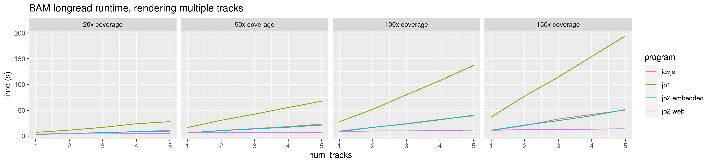
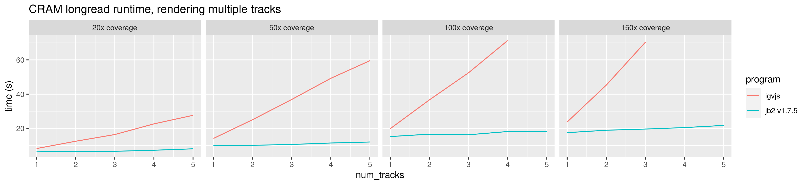

# jb2profile

Some profiling on jbrowse 2

## Pre-requisites

Install pbsim2, add to path

## Setup

To setup from scratch, see source code for the breakdown of the scripts

```
./everything.sh
```

## Results

### How to read results

- igvjs - a create-react-app with igv package from npm installed. the igv.js is instrumented to output "DONE" to the console when finished, and to have an increased fetchSizeLimit (which is otherwise git in CRAM longread tests)
- jbrowse-web-1.7.4 - stock
- jb2 noserial - removes serialization across webworker which removes ability
  to click on features, and is just here to demonstrate the overhead of
  serialization
- jb2 embedded lgv - a create-react-app with @jbrowse/react-linear-genome-view

## Notes

- these tests are all chrome based (using puppeteer library for automation),
  running same on firefox or safari may be slower (especially on jbrowse-web)
- these benchmarks are not comprehensive, and just a taste of some small
  examples on simulated data on hg19

### Platform

Ran tests on a Dell Precision i9 laptop, ~2019, Ubuntu 22.04

Tests will also be run on a Amazon EC2 instance xlarge 4vcpu 16gb memory ubuntu 20.04

### How to interpret test names

The test e.g. hg19-20x-shortread-cram-10kb.json shows the coverage of the file
being tested and region size being viewed

### Figures

#### Runtime


Note: the cram longread has failures in igv.js due to fetchSizeLimit being
triggered

#### Memory (probably not accurately be reporting webworker memory)


#### Main thread hanging time

Shows a plot of the seconds-per-frame (inverse of FPS) in order to highlight
frames that took an especially long time, essentially indicating when the
user-interface would be locked up


#### Rendering multiple tracks at once

This image shows two figures for rendering 5 tracks at once, in BAM and CRAM
format, and at low (20x) and md (200x) coverage. If no bar exists, then it
timed out (>10 minutes indicating memory out of bounds or extreme slowness).
This example is especially useful for webworkers which can parallelize
rendering

A key takeaway of these graphs is that the noserialize branch is the winner



