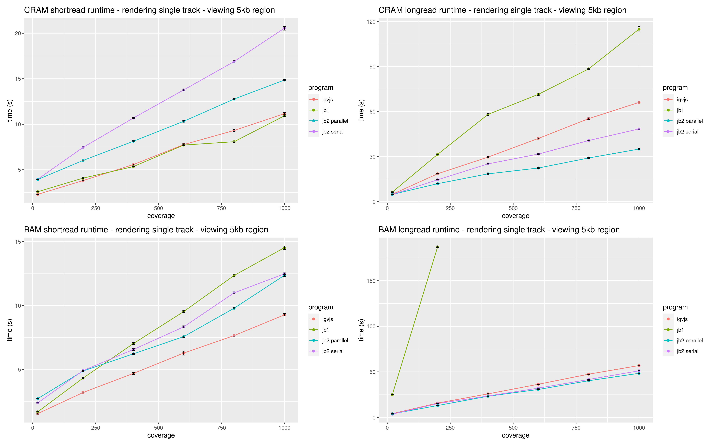
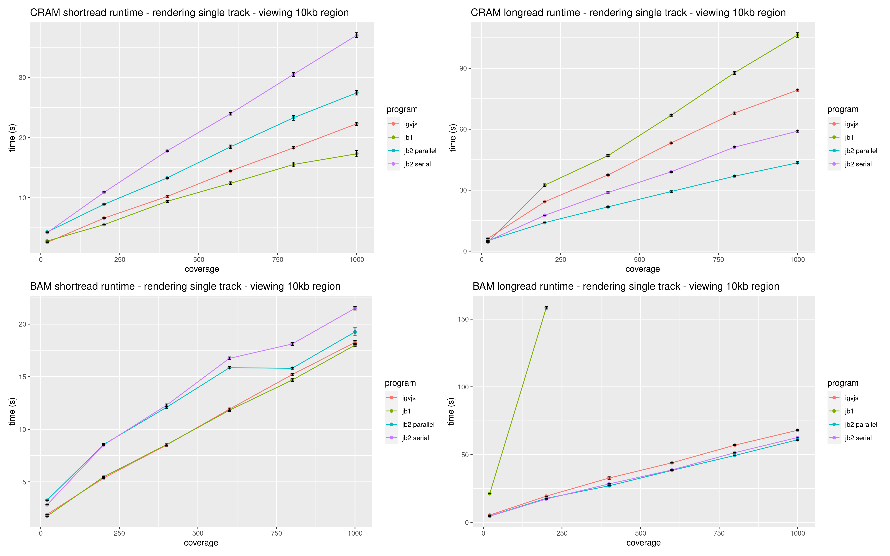
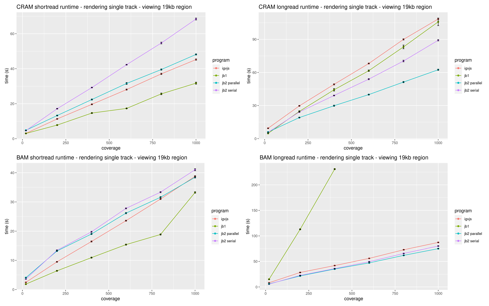
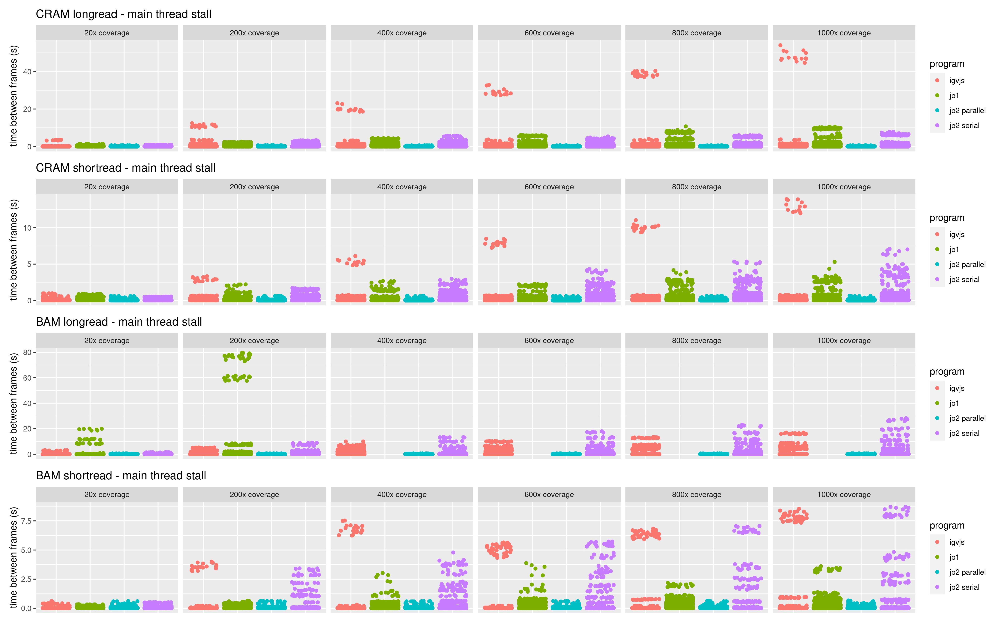
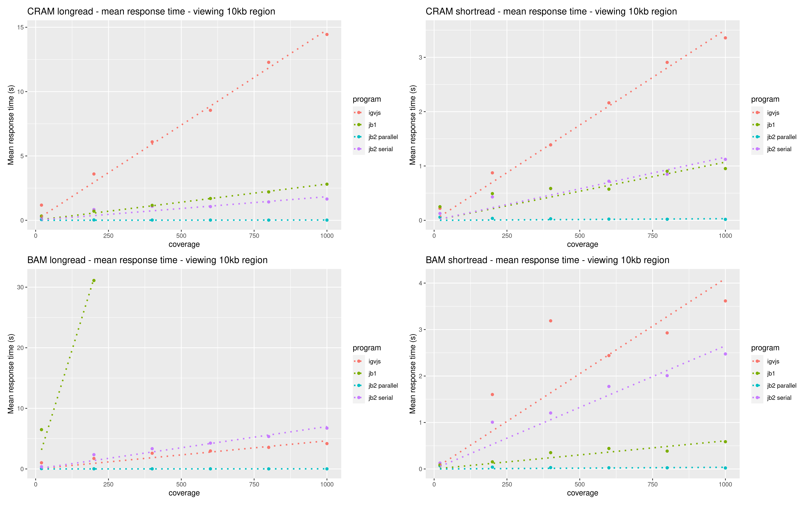

# jb2profile

Some profiling on jbrowse 2

## Pre-requisites

Install pbsim2, add to path

## Setup

To setup from scratch, see source code for the breakdown of the scripts

```
./everything.sh
```

## Background

We had a concerted effort to improve performance in JBrowse 2, particularly
alignments track performance, in early 2022. This lasted from versions ~1.6.4
-> 1.7.5. This README only shows the latest version, but older documents show
that versions 1.6.5 would timeout and fail under loads while the latest version
shows significantly better performance.

## Results

### How to read results

- igvjs - a create-react-app with igv package from npm installed. the igv.js is
  instrumented to output "DONE" to the console when finished, and to have an
  increased fetchSizeLimit (which is otherwise git in CRAM longread tests)
- jb2-web - stock instance of jbrowse-web v1.7.5
- jb1 - stock instance of jbrowse 1 v1.16.11
- jb2 embedded - a create-react-app with @jbrowse/react-linear-genome-view

## Notes

- these tests are all chrome based (using puppeteer library for automation),
  running same on firefox or safari may be slower (especially on jbrowse-web)
- this measures cold start e.g. loading the entire page
- these benchmarks are not comprehensive, and user other user experience
  measures can vary after the track is loaded for example

### Platform

Ran tests on an Dell Precision laptop 7540 (i9 processor, 32gb memory). Has
also been tested on Amazon EC2 xlarge (16gb memory) Ubuntu 22.04 instance,
where results are similar but somewhat slower to run.

### How to interpret test names

The test e.g. hg19-20x-shortread-cram-10kb.json shows the coverage of the file
being tested and region size being viewed

### Figures

#### Runtime

Rendering a single track at different zoom levels







#### Main thread hanging time

Shows a plot of the seconds-per-frame (inverse of FPS) in order to highlight
frames that took an especially long time, essentially indicating when the
user-interface would be locked up



Another way to look at this is frame # vs time


Looking at the expected value of the response time of the app:



#### Rendering multiple tracks at once

This image shows two figures for rendering different numbers of tracks at once,
in BAM and CRAM format, and at various coverage levels. If line is truncated, then
it timed out (>10 minutes indicating memory out of bounds or extreme slowness).
This example shows the power of webworkers which can parallelize rendering


